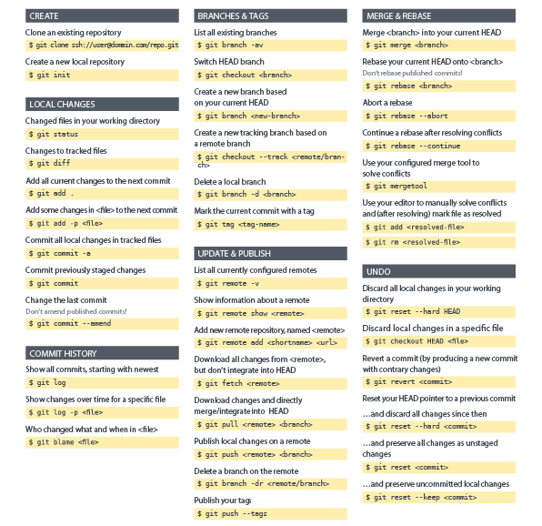

# Fluxo de trabalho

Guia prático 

### Criando um novo repositório

Crie uma nova pasta, abra-a e execute o comando
```
git init
```
para criar um novo repositório.

### Obtendo um repositório existente

Crie uma cópia de trabalho em um repositório local executando o comando
```
git clone /caminho/para/o/repositório
```

### Adicionando e confirmando mudanças

Você pode propor mudanças usando
```
git add <nome do arquivo>
```
ou
```
git add *
```
Este é o primeiro passo no fluxo de trabalho do git. 

Para realmente confirmar estas mudanças, use
```
git commit -m "descrição das alterações"
```
Agora o arquivo é enviado para o HEAD, mas ainda não para o repositório remoto.

### Atualizando e mesclando

Para atualizar seu repositório local com a mais nova versão, execute
```
git pull
```
na sua pasta de trabalho para obter e fazer merge (mesclar) alterações remotas.

### Enviando alterações

Suas alterações agora estão no HEAD da sua cópia de trabalho local. Para enviar estas alterações ao seu repositório remoto, execute
```
git push origin master
```

___

## Resumo de comandos git




___

## Referências

1 - [git - guia prático](https://rogerdudler.github.io/git-guide/index.pt_BR.html)

2 - [git](https://git-scm.com/doc)

